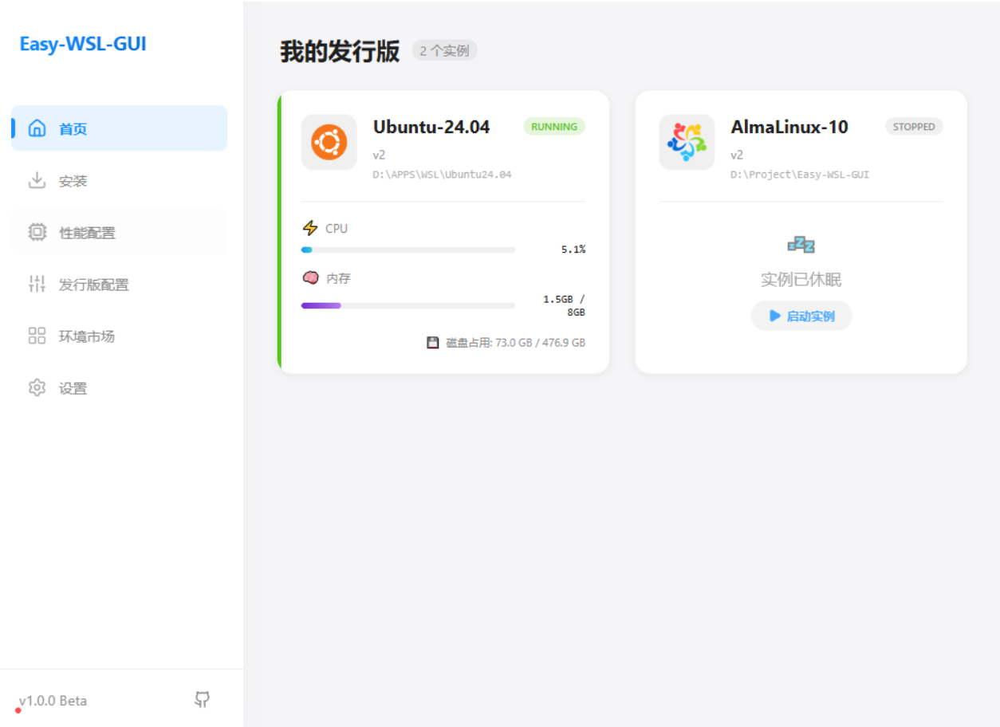
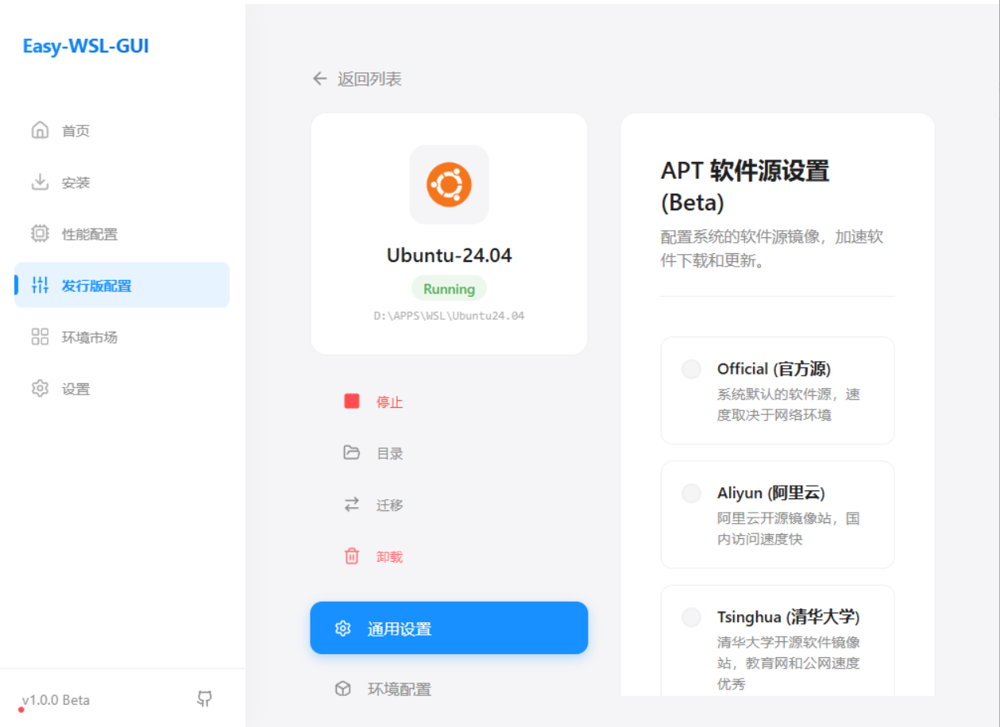

<div align="center">
  
  <h1 style="font-size: 28px; margin: 10px 0;">Easy-WSL-GUI</h1>
  <p>旨在降低WSL2安装门槛,小白也能轻松上手</p>
</div>

## ✨ UI Preview

<div align="center">
  <table>
    <tr>
      <td align="center" width="50%">
        
        <br>
        <b>主页 / Home</b><br>
        <sub></sub>
      </td>
      <td align="center" width="50%">
        
        <br>
        <b>安装 / Install</b><br>
        <sub></sub>
      </td>
    </tr>
    <tr>
      <td align="center" width="50%">
        
        <br>
        <b>配置 / Settings</b><br>
        <sub></sub>
      </td>
      <td align="center" width="50%">
         <br>
         <b></b>
      </td>
    </tr>
  </table>
</div>

## 🚀 核心功能

- **简单易上手**：减少安装WSL安装的学习成本,易于上手

- **加速下载**：使用多线程下载,加快下载速度,减少安装时长

- **管理可视化**：图形化管理安装发行版,更易于管理

- **迁移系统还原**：迁移系统不再丢失默认用户配置

## 🔮 未来规划

- [ ] **国内加速**: WSL发行包迁移Gitee
- [ ] **环境市场**: 无脑配置各项环境
- [ ] **Arm64安装支持**


## 🛠️ 开发版本
- Golang v1.25.4
- Wails CLI v2.11.0
- Vue3

## 🏗️ 构建指南

### 环境
- **Go**: Go 1.21+ (macOS 15+ requires Go 1.23.3+)
- **NPM**: (Node 15+)
- **Wails CLI**: `go install github.com/wailsapp/wails/v2/cmd/wails@latest`

### 构建
生成可执行文件 (构建产物位于 `build/bin` 目录)  
Linux也可构建文件
```bash
wails build -platform windows/amd64 -clean
```
